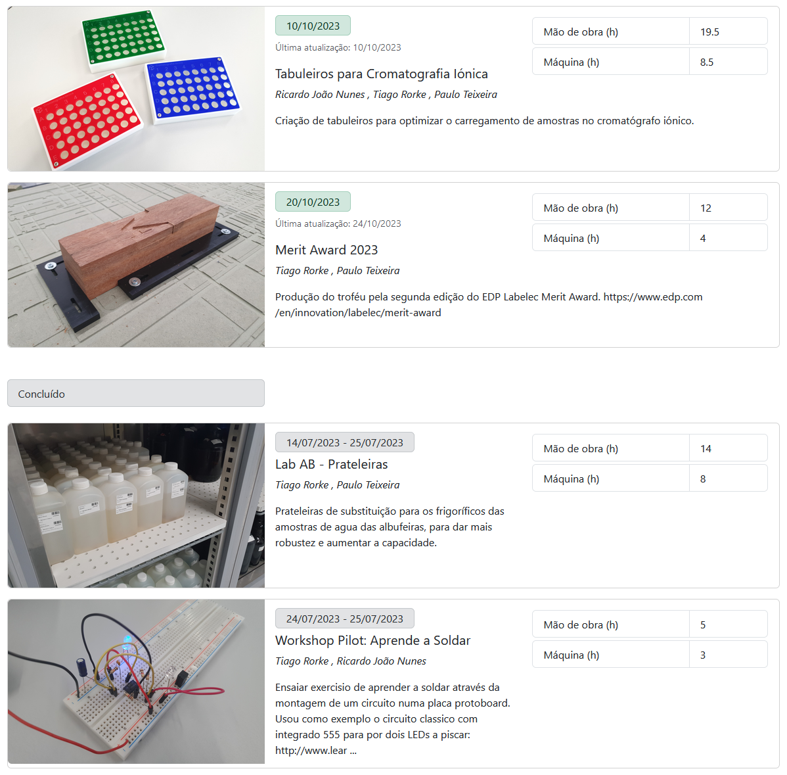
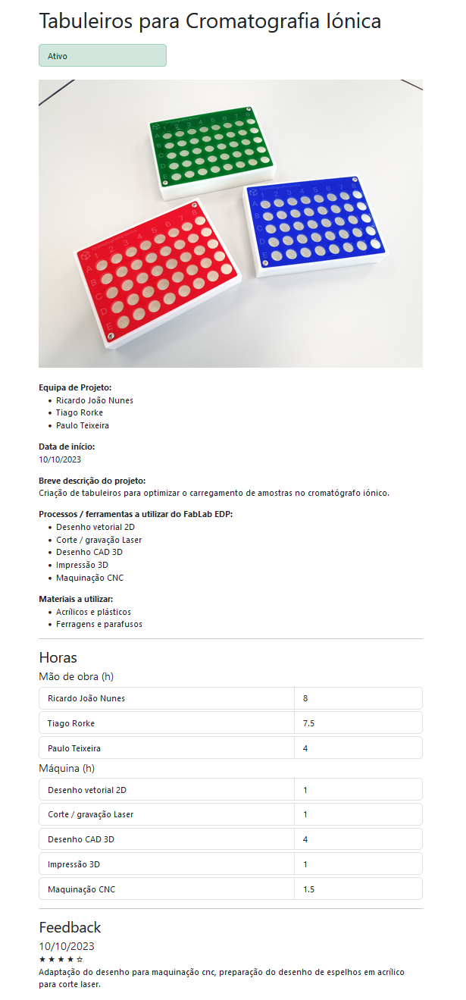
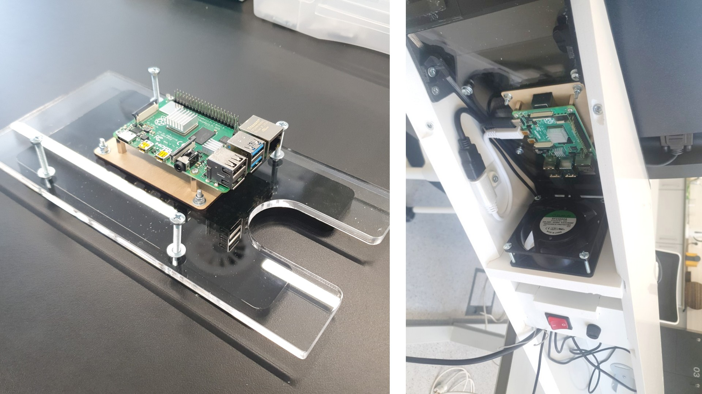
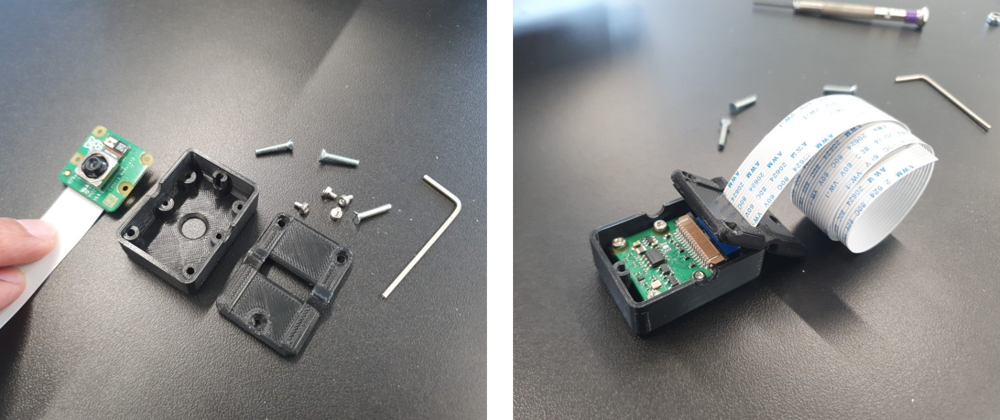

# FabLab EDP Kiosk

###### tags: `projects` `kiosk` `cnc` `laser-cutting` `3d-printing` `solidworks` `rhino` `electronics` `raspberry-pi` `nodejs`

We built this kiosk to register projects and users at our FabLab, providing a project gallery and records of human and machine hours.  
The software and CAD files are available on GitHub: [github.com/fablabedp/fablabedp-kiosk](https://github.com/fablabedp/fablabedp-kiosk)  

  

  

Users can upload media, register hours, leave updates and feedback, and give a final project evaluation. It also includes a photobooth tool that lets you take photos with the kiosk and associate them with projects or leave them in the photobooth gallery.  Media on the kiosk can also be sent to users by email.

  

The kiosk hardware uses a Raspberry Pi 4 in a CNC machined PVC stand. The kiosk software is built mostly with with Node.js and runs in chromium's kiosk mode. A  Raspberry Pi Camera Module 3 is used for the photobooth.

---

We designed a version using the Raspberry Pi 7in touch display, but ended up using a standard 21in lcd monitor.  There is a removable shelf for mouse and keyboard, in the touchscreen version it is smaller and designed to be hung vertically when not in use.  

  

The structural parts are machined from 15mm expanded PVC.

  

We used a v-cutter to miter the corners of the kiosk tower.

  

We assembled a test part to evaluate the miter cuts and slot fits. We experimented putting a 3mm fillet on the edges once assembled but decided to keep them sharp instead.

  

The front and sides are screwed and glued together with an acrilic adhesive, and the rear panel is attached with machine screws and threaded inserts.

  
  

The Raspberry Pi is cooled with a 220V fan, and we added an on/off switch and fuse which are hidden under a printed cover on the rear panel.

  

  

The camera assembly has a removable rear panel that allows the camera to be rotated 180 degrees.

  

To attach the tower to the base we used brackets from some [leveling feet](https://www.amazon.es/IGNPION-Nivelador-patas-muebles-piezas/dp/B09XXQ6LMD/), and we put locking coaster wheels on the base.  We included a 4G router inside the tower for providing connectivity to the kiosk when taking it to external events.

  

