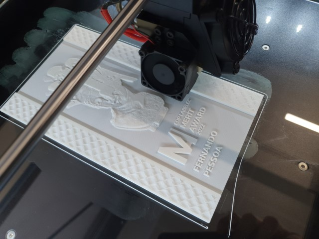

# Labelec Merit Award Trophy

###### tags: `projects` `cnc` `waterjet` `trophies` `solidworks` `labelec`

Trophy design for the inaugural [EDP Labelec Merit Award](https://www.edp.com/en/innovation/labelec/merit-award#award), recognizing academic excellence in the field of energy.  

  
Three concepts were proposed and prototyped with laser cutting and 3d printing.  One concept included the lithophane technique that works when back-lit.  

  
The metal parts were water-jet cut, with the copper piece manually bent.  

  
The wooden parts were milled on our pocket-nc, despite being a little oversize for the machine.  The rotational axis were useful for milling the front and sides of the part without needing to re-index the material.  

  
Graphic details were laser-engraved prior to varnishing.  

  
The metal parts were sanded and polished.  

  

  
Cork bases were applied and engraved.  

  
The finished trophies.  

